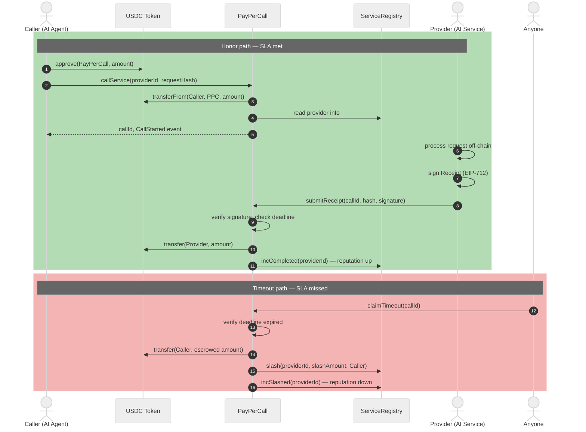

# ArcSLA

> 🏗️ Built by an [Arc Architects](https://www.arc.network) program member.

**On-chain SLA marketplace for autonomous services, on Arc.**

Providers stake USDC to commit to Service-Level Agreements. Callers pay per request. Stake is automatically slashed when SLAs are violated — no arbiter, no oracle, no off-chain dispute system.

ArcSLA is designed for the machine-to-machine economy: AI agents buying API calls, autonomous services transacting with each other, and any pay-per-call use case where trust must be encoded in the contract rather than assumed.

Built on [Arc Testnet](https://www.arc.network), Circle's stablecoin-native L1 where USDC is the native gas token.

---

## Why this exists

**AI agents are becoming economic actors.** A planning agent calls a retrieval agent. A research agent calls a summarization agent. A trading agent calls a price-feed agent. Each of these interactions is a paid API call between two autonomous programs that have never met and have no reason to trust each other.

Today those calls happen through three bad options:

1. **Trust the provider.** Agent pays up-front, hopes for a response. Breaks at scale.
2. **Trust a custodian.** Both parties deposit into an escrow run by a third party. Adds latency, adds a new point of failure, adds a fee.
3. **Trust a DAO.** Disputes go to human arbitration. Too slow for machine-speed transactions.

ArcSLA is the fourth option: **trust the code**.

A provider stakes USDC, commits to a max response time and slash percentage, and signs a cryptographic receipt when they fulfill a call. If they miss the deadline, anyone can trigger the slash. The contract transfers the escrow back to the caller plus a penalty from the provider's stake. All of this takes seconds on Arc.

The result is a permissionless marketplace where AI agents — or any program holding USDC — can buy API calls with automatic SLA enforcement and an on-chain reputation score.

---

## Built for AI agents

Here is a concrete scenario. Agent A is a research assistant running on a user's laptop. It needs to summarize a 200-page PDF. It doesn't have a summarization model locally, but there are dozens of providers offering this as a paid API.

**Without ArcSLA:**

```
Agent A → "send me your best summarization provider"
        → tries provider X, sends document, waits
        → provider X keeps the money, ignores the request
        → Agent A has no recourse except blacklisting
```

**With ArcSLA:**

```
Agent A → reads on-chain registry, picks provider by reputation + price
        → calls provider #42, escrows 0.10 USDC
        → provider has 30 seconds to return a signed receipt
        → if receipt arrives → provider gets paid, reputation up
        → if not → Agent A gets refund + 20% of provider's stake
```

Every step is a contract call. The agent needs no human supervision. The provider needs no billing system. The reputation score is a live `uint8` view on-chain, readable by any other contract — including a router that automatically picks the best provider for the next call.

### Why Arc specifically

AI-agent transactions have properties that traditional chains handle poorly:

- **They're frequent.** A single agent may make thousands of calls per hour. High fees kill the use case.
- **They're small.** A typical API call is worth 0.001–1 USDC. On Ethereum mainnet, the gas alone would exceed the call price.
- **They're USDC-denominated.** Agents carry USDC as working capital, not ETH. A chain that charges gas in a volatile token adds a second asset to manage.

Arc solves all three: [USDC is native gas](https://docs.arc.network/arc/concepts/welcome-to-arc), finality is sub-second, and fees are priced predictably in the same token the protocol charges in. A full call-and-receipt round trip costs ~0.017 USDC — less than a credit-card merchant fee.

---

## Live on Arc Testnet

**Try the live demo:** [**arcsla.vercel.app**](https://arcsla.vercel.app) — open in any modern browser with MetaMask.

### v3 contracts (current — ERC-8004 NFT + CCTP + x402)

| Contract | Address |
| --- | --- |
| ServiceRegistry | [`0x0FbC2841d0d56a57C3967472DDCaef825a38de02`](https://testnet.arcscan.app/address/0x0FbC2841d0d56a57C3967472DDCaef825a38de02) |
| PayPerCall | [`0x1A64e531Dc7498931A658F14AD6801108F372ed8`](https://testnet.arcscan.app/address/0x1A64e531Dc7498931A658F14AD6801108F372ed8) |
| CrossChainReceiver | [`0x9dA167e0d99de5aE8651449eaebB44ceDFE96F04`](https://testnet.arcscan.app/address/0x9dA167e0d99de5aE8651449eaebB44ceDFE96F04) |
| RegisterWithNFT | [`0x8910495C2a876c7b59a175CAc09F823B688b0eEb`](https://testnet.arcscan.app/address/0x8910495C2a876c7b59a175CAc09F823B688b0eEb) |
| USDC (native gas) | [`0x3600000000000000000000000000000000000000`](https://testnet.arcscan.app/address/0x3600000000000000000000000000000000000000) |

Deployed May 2026. Frontend points here.

### v1 contracts (legacy — EIP-191 signing)

| Contract | Address |
| --- | --- |
| ServiceRegistry | [`0x74635245CfF23a7F261CD5ECF72693cbc75481e4`](https://testnet.arcscan.app/address/0x74635245CfF23a7F261CD5ECF72693cbc75481e4) |
| PayPerCall | [`0x28aa00Af89483218E6Bc036a72C4bAe8A1514BFE`](https://testnet.arcscan.app/address/0x28aa00Af89483218E6Bc036a72C4bAe8A1514BFE) |

Live since April 2026 with 9 active providers. Remains operational; new registrations are routed to v3.

---

## What's in the demo

The demo at [arcsla.vercel.app](https://arcsla.vercel.app) is a single-file dapp (ethers.js v6, no build step) that exposes every part of the protocol:

### On the landing page (no wallet required)

- **Live network stats** — registered providers, calls on chain, slashes enforced
- **Live activity feed** — streams recent `CallStarted`, `ReceiptSubmitted`, `CallSlashed`, `ProviderRegistered` events from Arc Testnet
- **Contract address bar** — all contract addresses with one-click links to ArcScan

### Inside the app (after connecting a wallet)

- **Register as provider** — stake USDC, set SLA terms, choose slash %
- **Register with NFT (v2)** — mint an ERC-8004 AgentIdentity NFT and register in one transaction via `RegisterWithNFT` helper
- **Multi-chain payments** — pay from Ethereum Sepolia, Base Sepolia, or Polygon Amoy via CCTP V2; Arc enforces the SLA
- **x402 simulated flow** — HTTP 402 payment protocol simulation in-browser; shows the full x402 → pay → callService() lifecycle
- **Submit receipt** — EIP-712 typed signing (structured fields in wallet)
- **Claim timeout** — auto-slash when provider misses deadline
- **Auto-router** — picks highest-reputation active provider within price/rep filters
- **Session budget cap** — spending limit for agent flows
- **Live event feed** — real-time contract events
- **Leaderboard** — top 10 providers by Bayesian reputation score
- **24-hour activity chart** — hourly call volume with slash overlay
- **Provider detail modal** — full stats, call history, honor rate per provider

---

## x402 Integration

ArcSLA implements the [x402 HTTP Payment Protocol](https://x402.org) as a composable layer on top of the existing pay-per-call flow.

**How it composes:**

```
x402  → answers "how does the agent pay?" (HTTP 402, Circle Gateway rail)
ArcSLA → answers "what does the agent get for that payment?" (stake-backed SLA)
```

**Flow:**

```
1. Agent → GET /service (no payment)
2. Provider → 402 Payment Required + payment details
3. Agent → calls X402Middleware.executePayment() with USDC
4. Middleware → calls PayPerCall.callService() atomically
5. SLA clock starts on-chain
6. Provider delivers off-chain → submits EIP-712 receipt → gets paid
```

**Provider server:**

```bash
# Install dependencies
npm install

# Set env vars
PRIVATE_KEY=0x...
PROVIDER_ID=1
ARC_RPC_URL=https://rpc.testnet.arc.network

# Start x402 provider
npm run x402:provider
# → http://localhost:3000/service
```

**Test with curl:**

```bash
# Should return 402
curl http://localhost:3000/service

# Health check
curl http://localhost:3000/health
```

---

## CCTP Multi-chain

Callers on any supported chain can pay for ArcSLA calls using USDC from their native chain. Circle CCTP V2 bridges the payment to Arc Testnet, where SLA enforcement happens.

**Supported source chains (testnet):**
- Ethereum Sepolia (domain 0)
- Base Sepolia (domain 6)
- Polygon Amoy (domain 7)

**Flow:**
```
depositForBurn() on source chain
    → Circle Iris attestation (~20-60s)
    → receiveMessage() on Arc
    → CrossChainReceiver.handleReceiveFinalizedTransfer()
    → callService() fires automatically
```

Caller never needs to touch Arc directly.

---

## How it works



---

## Getting started

### Prerequisites

```bash
curl -L https://foundry.paradigm.xyz | bash
foundryup
```

### Install and build

```bash
git clone https://github.com/muazzezwq/arcsla
cd arcsla
forge install
forge build
```

### Run tests

```bash
forge test -vv
```

Expected: **66 tests passed, 0 failed.**

### Try the demo

Open [arcsla.vercel.app](https://arcsla.vercel.app) with MetaMask — Arc Testnet will be added automatically.

Or run locally:

```bash
cd demo
python3 -m http.server 8080
```

### Deploy your own copy

```bash
cp .env.example .env
# Fill USDC_ADDRESS (0x3600...0000 on Arc Testnet)

cast wallet import deployer --interactive

forge script script/Deploy.s.sol:Deploy \
  --account deployer \
  --sender 0xYOUR_DEPLOYER \
  --rpc-url arc_testnet \
  --broadcast
```

See [`DEPLOY.md`](./DEPLOY.md) for the full walkthrough.

---

## Solidity example

```solidity
// 1. Agent approves USDC
usdc.approve(payPerCall, 1e6);

// 2. Agent opens the call
bytes32 requestHash = keccak256(abi.encode("summarize this document"));
bytes32 callId = payPerCall.callService(1, requestHash);

// 3. Provider delivers the response off-chain, signs EIP-712 receipt
bytes32 responseHash = keccak256(responseBytes);
bytes memory signature = providerSigner.signTypedData(domain, types, value);

// 4. Provider submits the receipt on-chain — escrow released, reputation bumped
payPerCall.submitReceipt(callId, responseHash, signature);

// 5. Or, if 30 seconds passed without a receipt:
payPerCall.claimTimeout(callId);
// → escrow refunded + stake slashed + reputation decreased
```

---

## Project layout

```
arcsla/
├── src/
│   ├── ServiceRegistry.sol          # provider registry, stake, ERC-8004 NFT binding, Bayesian reputation
│   ├── PayPerCall.sol               # call escrow, EIP-712 receipt verification, timeout enforcement
│   ├── CrossChainReceiver.sol       # CCTP V2 receiver — bridges multi-chain USDC to callService()
│   ├── RegisterWithNFT.sol          # helper: mint ERC-8004 NFT + registerV2() in one tx
│   ├── X402Middleware.sol           # x402 payment middleware — bridges HTTP 402 payments to callService()
│   └── interfaces/
│       ├── IServiceRegistry.sol
│       └── IPayPerCall.sol
├── test/
│   ├── ServiceRegistry.t.sol        # 57 unit tests (v1 + v2 + ERC-8004 NFT)
│   ├── PayPerCall.t.sol             # 9 unit tests
│   └── helpers/
│       └── MockUSDC.sol
├── script/
│   └── Deploy.s.sol                 # deploys ServiceRegistry + PayPerCall + CrossChainReceiver
├── scripts/
│   ├── x402-provider.js             # Node.js x402 provider server (Express + ethers v6)
│   └── bridge-and-call.ts           # CCTP bridge helper script
├── demo/
│   └── index.html                   # single-file dapp (ethers.js v6, no build step)
├── docs/
│   └── v2-design.md
├── SPEC.md
├── ARCHITECTURE.md
├── SECURITY.md
├── DEPLOY.md
└── README.md
```

---

## Known limitations

- **CCTP attestation takes 1-4 minutes.** Sepolia requires ~12-19 block confirmations before Circle Iris issues an attestation. The demo polls for up to 5 minutes.
- **x402 flow is simulated in browser.** The demo's "Call via x402" button simulates the HTTP 402 → pay → callService() lifecycle without a real HTTP server. For production x402, run `scripts/x402-provider.js`.
- **Event scan window is 100,000 blocks.** Very old calls won't appear in the "Calls" stat. A proper indexer is planned.

---

## Roadmap

### ✅ Completed

- **EIP-712 typed signing** — structured receipt previews in wallet
- **ERC-8004 NFT identity binding** — `registerV2()` requires AgentIdentity NFT; `RegisterWithNFT` helper mints NFT + registers in one tx
- **CCTP multi-chain payments** — Ethereum/Base/Polygon → Arc via Circle CCTP V2
- **x402 HTTP payment protocol** — `X402Middleware.sol` + `x402-provider.js` server
- **Bayesian on-chain reputation** — `(completed + 2) / (total + 3) × 100`
- **Auto-router** — picks best provider by reputation + price filters
- **Session budget cap** — spending limit for agent flows
- **66/66 Foundry tests**

### Planned

- EIP-1271 support (contract-wallet callers)
- Optional DisputeModule for subjective-quality services
- Mainnet deployment once Arc Mainnet is live
- Reputation-weighted routing contract

---

## Resources

### Arc & Circle

- [Arc Network](https://www.arc.network/) — project homepage
- [Arc documentation](https://docs.arc.network/arc/concepts/welcome-to-arc) — concepts, architecture, guides
- [Circle Developers](https://developers.circle.com/) — SDKs, CCTP, Gateway, Paymaster
- [Circle Console](https://console.circle.com/signin) — API keys, testnet dashboards

### Testnet tools

- [Arc Testnet Faucet](https://faucet.circle.com/) — free testnet USDC (also serves as gas)
- [ArcScan Testnet](https://testnet.arcscan.app/) — block explorer
- [thirdweb Arc Testnet](https://thirdweb.com/arc-testnet) — chain config, contract explorer

### Project documents

- [`ARCHITECTURE.md`](./ARCHITECTURE.md) — design decisions and rationale
- [`SECURITY.md`](./SECURITY.md) — threat model and known trade-offs
- [`DEPLOY.md`](./DEPLOY.md) — step-by-step deployment guide
- [`SPEC.md`](./SPEC.md) — original technical specification

---

## License

MIT. Not affiliated with Circle, Arc, or any project mentioned above. Built independently for the Arc Architects community.
