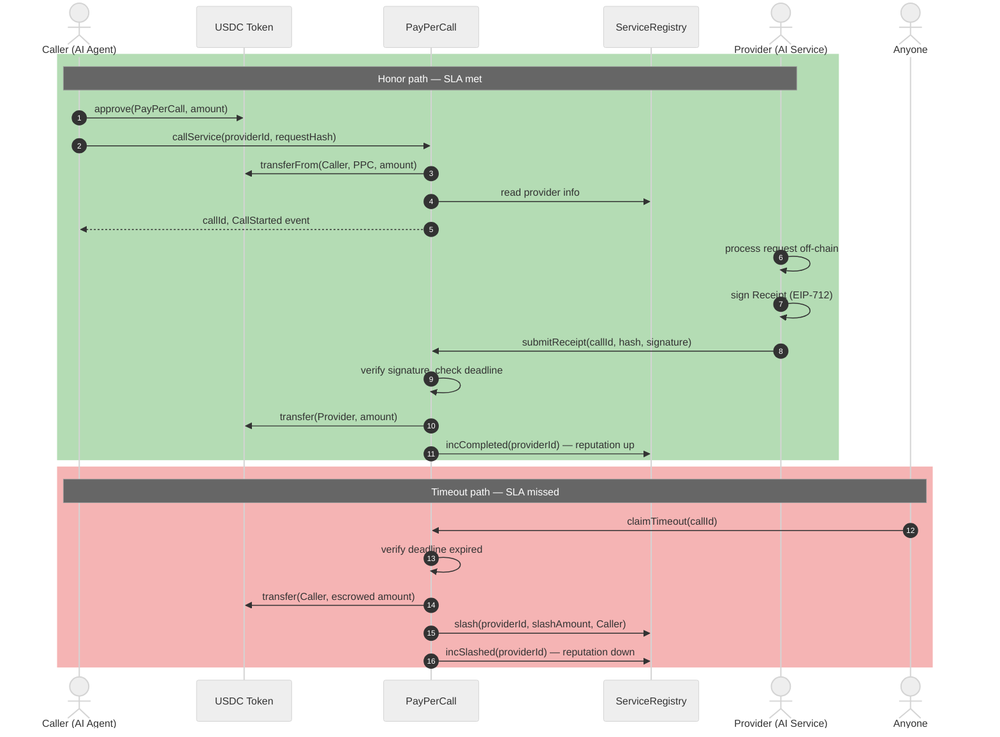

# CallGuard

> Built by an Arc Architects program member.

**Programmable service settlement for autonomous services — built on Arc.**

Providers stake USDC and commit to a response-time SLA. Callers pay per request and get a signed receipt. Miss the deadline and the stake is slashed automatically — no court, no arbiter, no middleman.

Built on [Arc Testnet](https://www.arc.network), Circle's stablecoin-native L1 where USDC is the native gas token. Every interaction — call, receipt, slash — costs a fraction of a cent and settles in under a second.

**Live demo:** [arcsla.vercel.app/app](https://arcsla.vercel.app/app/)

---

## Why this matters

AI agents and autonomous services are becoming core infrastructure. As they interact with more external APIs and digital services, they need a reliable way to pay, verify execution, and hold providers accountable — without trusting a centralized intermediary.

CallGuard makes service reliability programmable:

- Provider stakes USDC as a performance bond
- Caller pays per request — USDC goes into escrow
- Provider signs an EIP-712 receipt after delivery — escrow releases
- If the provider misses the SLA window, anyone can trigger a slash — caller gets a refund plus a bonus from the stake

No governance vote. No dispute arbitration. Just contract-defined outcomes.

---

## Live on Arc Testnet

### Core Contracts

| Contract | Address | Deployed |
|---|---|---|
| `ServiceRegistry` | [`0xea00f898C0eA249de7226b283e93C13eFa7BbcFF`](https://explorer.testnet.arc.io/address/0xea00f898C0eA249de7226b283e93C13eFa7BbcFF) | Sep 2026 |
| `PayPerCall` (v2) | [`0x10387347678d9f7106D5625bE0BD6C915158B130`](https://explorer.testnet.arc.io/address/0x10387347678d9f7106D5625bE0BD6C915158B130) | Sep 2026 |
| `CrossChainReceiver` | [`0x28a683A5fAB9B5DC2608089e86d733aB1f116e5c`](https://explorer.testnet.arc.io/address/0x28a683A5fAB9B5DC2608089e86d733aB1f116e5c) | Sep 2026 |
| `AgenticCommerce` (ERC-8183) | [`0x0747EEf0706327138c69792bF28Cd525089e4583`](https://explorer.testnet.arc.io/address/0x0747EEf0706327138c69792bF28Cd525089e4583) | Sep 2026 |
| `Dispute` | [`0xa47162d8e4785d867f05800f35a334fd78575e56`](https://explorer.testnet.arc.io/address/0xa47162d8e4785d867f05800f35a334fd78575e56) | Sep 2026 |
| `Subscription` | [`0xef7d56390f86a5cecc05f75e265859a1c79cefe6`](https://explorer.testnet.arc.io/address/0xef7d56390f86a5cecc05f75e265859a1c79cefe6) | Sep 2026 |

### v2 Protocol Contracts (Oct 2026)

| Contract | Address | Purpose |
|---|---|---|
| `DisputeQuality` | [`0x3c9bDc353861010A9ebfD8Ae5d31d44C5bb14725`](https://explorer.testnet.arc.io/address/0x3c9bDc353861010A9ebfD8Ae5d31d44C5bb14725) | Verifiable AI output — community stake-weighted voting |
| `SLAFutures` | [`0xa6f194c621eE67559aDcA883824e01F1828e887c`](https://explorer.testnet.arc.io/address/0xa6f194c621eE67559aDcA883824e01F1828e887c) | Provider capacity tokenized as ERC-1155 NFTs |
| `ReputationLoan` | [`0xE656dF6512e9d10e555518b7342fd8c81c42B8c0`](https://explorer.testnet.arc.io/address/0xE656dF6512e9d10e555518b7342fd8c81c42B8c0) | Reputation-as-collateral USDC lending (RepFi) |
| `SLAAttestationBridge` | [`0x62a63a94a41601fdb8e9d60ed7e56b1e4c4c5da7`](https://explorer.testnet.arc.io/address/0x62a63a94a41601fdb8e9d60ed7e56b1e4c4c5da7) | Cross-protocol SLA oracle — onchain attestations |
| `AgentWallet` | [`0xf73f2Fc55dd985E583516a4614f2A2c1Da0Ae8E6`](https://explorer.testnet.arc.io/address/0xf73f2Fc55dd985E583516a4614f2A2c1Da0Ae8E6) | ERC-4337 smart wallet with daily spend limits |

---

## How it works


```mermaid
%%{init: {'theme':'neutral'}}%%
sequenceDiagram
    autonumber
    actor Caller as Caller (AI Agent)
    participant USDC as USDC Token
    participant PPC as PayPerCall
    participant SR as ServiceRegistry
    actor Provider as Provider (AI Service)
    actor Anyone as Anyone

    rect rgb(180, 220, 180)
    Note over Caller,Provider: Honor path — SLA met

    Caller->>USDC: approve(PayPerCall, amount)
    Caller->>PPC: callService(providerId, requestHash)
    PPC->>USDC: transferFrom(Caller, PPC, amount)
    PPC->>SR: read provider info
    PPC-->>Caller: callId, CallStarted event

    Provider->>Provider: process request off-chain
    Provider->>Provider: sign Receipt (EIP-712)

    Provider->>PPC: submitReceipt(callId, hash, signature)
    PPC->>PPC: verify signature, check deadline
    PPC->>USDC: transfer(Provider, amount)
    PPC->>SR: incCompleted(providerId) — reputation up
    end

    rect rgb(245, 180, 180)
    Note over Caller,Anyone: Timeout path — SLA missed

    Anyone->>PPC: claimTimeout(callId)
    PPC->>PPC: verify deadline expired
    PPC->>USDC: transfer(Caller, escrowed amount)
    PPC->>SR: slash(providerId, slashAmount, Caller)
    PPC->>SR: incSlashed(providerId) — reputation down
    end
```

---

## What's in the app

The app at [arcsla.vercel.app/app](https://arcsla.vercel.app/app/) is a full-featured single-file dapp (ethers.js v6) that exposes every layer of the protocol.

### Onboarding

- **Onboarding progress bar** — sticky 3-step guide on first login: Get USDC → Browse providers → Make first call; each step auto-completes and persists in localStorage
- **Quick Start modal** — 3-step guided setup shown once on first wallet connection
- **Role choice modal** — on first connection, choose Caller or Provider; routes directly to the relevant flow
- **Simple / Pro mode** — toggle in the topbar; Simple mode hides advanced panels; Pro mode exposes all 20+ features

### Before connecting a wallet

- **Live network stats** — registered providers, calls on-chain, slashes enforced in real time
- **Live activity feed** — streams `CallStarted`, `ReceiptSubmitted`, `CallSlashed`, `ProviderRegistered` events from Arc Testnet
- **Provider browse** — browse all providers with reputation scores without connecting a wallet
- **Animated landing** — particle network, count-up stats, scroll-triggered section reveals

### Provider tools

- **Register (v1)** — stake USDC, set price, SLA window, and slash percentage
- **Register with NFT (v2)** — mint an ERC-8004 AgentIdentity NFT and register in a single transaction; NFT badge persists in the dashboard
- **Provider dashboard** — live reputation score, honor rate, recent calls, stake balance, and analytics via Goldsky subgraph
- **Provider profile page** — load any provider by ID to view stats, earnings, and call history; shareable `?provider=N` URL
- **Provider recruitment banner** — shows top earner's income on the Register page to motivate new providers
- **Revenue calculator** — estimate monthly earnings based on call volume, price, and honor rate
- **Provider setup checklist** — step-by-step pre-registration guide
- **Deactivate + Unstake** — wind down a position; withdraw stake once all pending calls settle
- **Endpoint health check** — live ping for each registered provider via facilitator proxy

### Caller tools

- **Direct call** — pick a provider, set a payload, approve USDC, call — all in one flow
- **Call Wizard** — guided 3-step flow for first-time callers
- **Cost calculator** — preview USDC cost, SLA terms, and slash bonus before signing
- **Caller protection** — honor rate warning when a provider's score is below 30%; red banner + confirmation gate below 10%
- **Underfunded provider badge** — warns when a provider's stake is lower than the expected slash amount
- **SLA countdown** — live timer for open calls; "Claim Timeout →" button activates automatically when the window expires
- **Auto-retry on timeout** — after a timeout claim, toast prompts "Retry with next best provider?" for one-click retry
- **Auto-router v3** — selects the best provider using a 6-factor weighted score: honor rate (35%), reputation (25%), price (15%), stake size (15%), response speed (10%), minus slash penalty
- **Batch call slider** — choose 1–20 calls to the same provider with cost preview; one approval, sequential execution
- **Bulk call (CSV)** — send the same request to multiple providers simultaneously; results in a comparison table
- **Provider comparison** — select 2–4 providers in the Marketplace and compare price, honor rate, stake, and earnings side by side
- **Submit receipt** — provider signs an EIP-712 receipt; MetaMask shows readable fields (callId, responseHash)
- **Claim timeout** — trigger a slash after the SLA window expires; caller gets a refund plus a bonus

### Payment rails

- **x402 (HTTP 402)** — real HTTP payment flow; client signs an EIP-3009 authorization off-chain (no gas), facilitator calls `callServiceWithAuthorization()` onchain
- **x402 Live Tester** — test `energy-data` and `premium-report` endpoints directly from the UI; 402 terms shown before payment
- **Circle Gateway Nanopayments** — gasless 0.001 USDC micro-payments; no MetaMask prompt, no confirmation
- **CCTP multi-chain** — pay from Ethereum Sepolia, Base Sepolia, or Polygon Amoy; CCTP V2 bridges USDC to Arc
- **Cross-chain selector** — pill switcher in the Call Builder: Arc / Base / Ethereum / Polygon

### v2 Protocol Features (Oct 2026)

- **Verifiable AI Output (DisputeQuality)** — response hash committed onchain; community arbiters vote on quality disputes; stake-weighted majority wins
- **SLA Futures (SLAFutures)** — providers tokenize future capacity as ERC-1155 NFTs; callers buy priority slots; NFTs trade on secondary markets; onboarding wizard for first batch
- **RepFi Lending (ReputationLoan)** — providers with honor rate > 90% can borrow USDC stake from the reputation pool; pool LPs earn APY from slash revenue + interest
- **Autonomous Agent Loop (AgentWallet)** — ERC-4337 smart wallet with configurable daily spend limit; any AI (Claude, GPT, Llama) calls services autonomously via MCP + x402 with zero human approval; deploy + fund flow in UI
- **SLA Attestation Bridge (SLAAttestationBridge)** — cross-protocol SLA oracle; any protocol queries CallGuard onchain: "Did this provider honor X calls?"; REST API endpoint at `/api/attestation`

### Settlement and history

- **Transaction History** — full call/receipt/slash/timeout history sourced from Goldsky subgraph; filterable by type and status
- **Receipt verification** — enter a TX hash or call ID; verifies receipt onchain without a wallet; shareable `?verify=0x...` URL
- **Disputes panel** — open and resolved disputes with slash history from Goldsky
- **Subscriptions panel** — recurring payment history and renewal tracking
- **My Calls** — full call history for the connected wallet with status indicators
- **Receipts** — all submitted receipts with on-chain verification status
- **Payments** — USDC in/out transaction history

### Jobs (ERC-8183)

- **Job wizard** — 5-step lifecycle: Create → Set Budget → Fund → Submit → Complete; role badges for Client, Provider, and Evaluator
- **My Jobs** — one-click list of all jobs where you are client or provider, sourced from Goldsky subgraph
- **Auto-advance** — wizard moves to the next step automatically after each on-chain confirmation

### Developer tools

- **API Documentation panel** — all 9 REST endpoints with method/auth badges, live "Try it" links, and cURL/JS/Python code examples
- **MCP server** — 6 tools for AI agents: list providers, leaderboard, health check, nanopay, network stats, Arc docs search; works with Claude Desktop, Cursor, or any MCP-compatible client
- **MCP Test with AI** — run `list_providers` directly from the UI; simulates real MCP agent call with subgraph fallback
- **Embed widget** — add `<script src="arcsla.vercel.app/api/widget.js">` to any site; `data-callguard-provider="N"` attribute creates a "Pay with CallGuard" button
- **Webhooks** — configure webhook endpoints for live event delivery; test tool sends a real `call.opened` payload
- **Webhook alert subscriptions** — email + Telegram Chat ID subscription; configure events (slash, timeout, receipt, expiring SLA); no server required
- **Multicall3From** — batch calls to multiple providers in one transaction using Arc's native batching contract
- **Arc Memo** — every x402 call attaches a human-readable onchain memo via Arc's Memo contract
- **SDK examples** — working code snippets in Browser JS, Node.js, Python, and curl

### Infrastructure and analytics

- **Goldsky subgraph v2.0.0** — indexes Provider, Call, Dispute, and Subscription events; powers real-time GraphQL queries
- **Real-time 15-second polling** — auto-refreshes hero stats and live activity when new blocks arrive; tab title shows countdown when in background
- **Analytics panel** — provider activity charts, honor rate trends, call volume
- **Leaderboard** — top providers by Bayesian reputation score; Slash Leaderboard shows top timeout claimers and most-slashed providers
- **Band Protocol oracle** — live USDC/USD price feed
- **Post-quantum receipt signing** — SLH-DSA-SHA2-128s (NIST FIPS 205)
- **Arc Privacy Sector (APS)** — vision panel for private SLA calls inside hardware enclaves

### UX features

- **Dark / Light theme** — toggle in the topbar; preference persists across sessions; dark mode default
- **Mobile-first responsive design** — all panels adapt from 320px to 1440px; swipe-to-close sidebar on mobile
- **Multi-wallet support** — MetaMask, Coinbase Wallet, Rainbow, and any injected wallet via picker modal
- **Reputation badge** — green badge notification when honor rate exceeds 90% with 10+ calls
- **Session budget cap** — set a USDC spending limit; banner warns before any call that would exceed it
- **CMD palette** — press `⌘K` / `Ctrl+K` to navigate anywhere from the keyboard
- **Notifications panel** — in-app event log for completed calls, receipts, slashes, and system alerts
- **EURC + USYC balances** — header shows all Arc ecosystem token balances

---

## REST API

Base URL: `https://arcsla.vercel.app`

| Endpoint | Method | Description |
|---|---|---|
| `/api/health` | GET | Facilitator health — RPC, signer, contract status |
| `/api/attestation?providerId=N&type=score` | GET | Provider reputation score (no wallet needed) |
| `/api/attestation?callId=0x...` | GET | Call receipt verification |
| `/api/call-service` | POST | Facilitator-mediated call (x402 flow) |
| `/api/nano-call` | POST | Gateway nanopayment call |
| `/api/nano-balance` | GET | Nanopayment balance for an address |
| `/api/auto-receipt` | POST | Provider auto-receipt webhook |
| `/api/energy-data` | GET | x402 gated endpoint (demo) |
| `/api/premium-report` | GET | x402 gated endpoint (demo) |
| `/api/widget.js` | GET | Embed script for third-party sites |

---

## Embed widget

Add CallGuard payment to any website in one line:

```html
<script src="https://arcsla.vercel.app/api/widget.js"></script>
<button data-callguard-provider="1" data-callguard-payload="hello">
  Pay with CallGuard
</button>
```

The script auto-discovers all `[data-callguard-provider]` buttons and wires up the full USDC payment + SLA flow.

---

## x402 integration

```
x402       → answers "how does the agent pay?" (HTTP 402, EIP-3009 authorization)
CallGuard  → answers "what does the agent get?" (stake-backed SLA, verifiable receipt)
```

**Flow:**

```
1. Agent  → GET /service  (no payment)
2. Server → 402 Payment Required + payment requirements
3. Agent  → signs EIP-3009 TransferWithAuthorization off-chain (no gas)
4. Facilitator → calls callServiceWithAuthorization() onchain
5. SLA clock starts — USDC in escrow
6. Provider delivers off-chain → submits EIP-712 receipt → gets paid
```

**Start a provider server:**

```bash
cd scripts
PRIVATE_KEY=0x... PROVIDER_ID=1 ARC_RPC_URL=https://rpc.testnet.arc.io node x402-provider.js
# → http://localhost:3000/service
```

---

## CCTP multi-chain payments

Callers on any supported chain pay with their native USDC. CCTP V2 bridges it to Arc where SLA enforcement happens.

**Supported source chains (testnet):** Ethereum Sepolia · Base Sepolia · Polygon Amoy

```
depositForBurn() on source chain
    → Circle Iris attestation (~20-60s)
    → receiveMessage() on Arc
    → CrossChainReceiver.handleReceiveFinalizedTransfer()
    → callService() fires automatically
```

---

## Getting started

### Prerequisites

```bash
curl -L https://foundry.paradigm.xyz | bash && foundryup
```

### Install and build

```bash
git clone https://github.com/muazzezwq/CallGuard
cd CallGuard
forge install && forge build
```

### Run tests

```bash
forge test -vv
```

Expected: **218 tests passed, 0 failed.**

### Try the demo

Open [arcsla.vercel.app/app](https://arcsla.vercel.app/app/) with MetaMask — Arc Testnet is added automatically.

Get free testnet USDC from the [Arc Testnet Faucet](https://faucet.circle.com/) (also covers gas).

### Deploy your own copy

```bash
cp .env.example .env
# Set USDC_ADDRESS=0x3600000000000000000000000000000000000000

cast wallet import deployer --interactive

forge script script/Deploy.s.sol:Deploy \
  --account deployer \
  --sender 0xYOUR_DEPLOYER \
  --rpc-url arc_testnet \
  --broadcast
```

See [`DEPLOY.md`](./DEPLOY.md) for the full walkthrough.

---

## Solidity example

```solidity
// 1. Caller approves USDC
usdc.approve(address(payPerCall), 1e6); // 1 USDC

// 2. Caller opens the call — USDC goes into escrow
bytes32 requestHash = keccak256(abi.encode("summarize this document"));
bytes32 callId = payPerCall.callService(providerId, requestHash);

// 3. Provider processes off-chain, signs an EIP-712 receipt
bytes32 responseHash = keccak256(responseBytes);
bytes memory sig = providerSigner.signTypedData(domain, types, value);

// 4. Provider submits the receipt — escrow releases, reputation increases
payPerCall.submitReceipt(callId, responseHash, sig);

// 5. If the provider misses the deadline — anyone can slash
payPerCall.claimTimeout(callId);
// → caller refunded + provider stake slashed + reputation decreases
```

---

## Project layout

```
CallGuard/
├── src/
│   ├── ServiceRegistry.sol       # provider registry, stake, ERC-8004 NFT binding, Bayesian reputation
│   ├── PayPerCall.sol            # call escrow, EIP-712 receipt verification, timeout/slash
│   ├── DisputeQuality.sol        # verifiable AI output — community stake-weighted voting
│   ├── SLAFutures.sol            # provider capacity tokenized as ERC-1155 NFTs
│   ├── ReputationLoan.sol        # reputation-as-collateral USDC lending (RepFi)
│   ├── SLAAttestationBridge.sol  # cross-protocol SLA oracle, REST API
│   ├── AgentWallet.sol           # ERC-4337 smart wallet, daily spend limit
│   ├── Subscription.sol          # recurring payment model
│   ├── Dispute.sol               # dispute resolution with stake slashing
│   ├── CrossChainReceiver.sol    # CCTP V2 — bridges multi-chain USDC into callService()
│   ├── RegisterWithNFT.sol       # mints ERC-8004 NFT + registerV2() in one transaction
│   └── X402Middleware.sol        # bridges HTTP 402 / EIP-3009 into callService()
├── test/                         # 218 Foundry tests
├── script/                       # deploy scripts for all contracts
├── scripts/
│   ├── x402-provider.js          # Node.js x402 provider server
│   └── bridge-and-call.ts        # CCTP bridge helper
├── api/                          # Vercel serverless functions
│   ├── health.js                 # health check
│   ├── attestation.js            # SLA oracle REST API
│   ├── call-service.js           # x402 facilitator
│   ├── nano-call.js              # Gateway nanopayment
│   ├── auto-receipt.js           # provider webhook
│   ├── widget.js                 # embed script
│   └── ...
├── app/app/index.html            # single-file dapp (ethers.js v6, no build step)
├── subgraph/                     # Goldsky subgraph v2.0.0
├── x402-facilitator/             # x402 + Gateway facilitator server
├── docs/
├── SPEC.md
├── ARCHITECTURE.md
├── SECURITY.md
└── DEPLOY.md
```

---

## Known limitations

- **CCTP attestation takes 1-4 minutes.** Sepolia requires ~12-19 block confirmations before Circle Iris issues an attestation. The demo polls for up to 5 minutes.
- **Event scan window is 100,000 blocks.** Very old calls won't appear in the Calls panel. Goldsky subgraph covers the full history.
- **Testnet only.** All contracts are deployed on Arc Testnet. Mainnet deployment planned after audit.

---

## Roadmap

### Completed (Sep–Oct 2026)

**Core Protocol**
- EIP-712 typed receipt signing — structured receipt preview in MetaMask
- ERC-8004 NFT identity binding — `registerV2()` requires AgentIdentity NFT; mint + register in one tx
- CCTP multi-chain payments — Ethereum / Base / Polygon → Arc via Circle CCTP V2
- x402 HTTP payment protocol — full EIP-3009 authorization flow, gasless for the caller
- Circle Gateway Nanopayments — gasless micro-payments, server-side settlement
- ERC-8183 Jobs — full 5-step lifecycle wizard with role badges
- 218/218 Foundry tests

**v2 Protocol (Oct 2026)**
- DisputeQuality — verifiable AI output, community stake-weighted arbitration
- SLAFutures — provider capacity as tradeable ERC-1155 NFTs
- ReputationLoan (RepFi) — reputation-as-collateral USDC lending
- AgentWallet — ERC-4337 autonomous agent wallet with spend limits
- SLAAttestationBridge — cross-protocol SLA oracle with REST API

**App & UX**
- Dark mode default + light/dark toggle
- Mobile-first responsive layout (320px–1440px)
- Swipe-to-close sidebar on mobile
- Multi-wallet picker (MetaMask, Coinbase, Rainbow, injected)
- Onboarding progress bar — 3-step sticky guide
- SLA countdown timer — auto-activates claim button on deadline
- Caller protection — low honor rate warning + underfunded provider badge
- Auto-retry on timeout — one-click retry with next best provider
- Batch call slider — 1–20 calls with cost preview
- Provider comparison modal — side-by-side stats for up to 4 providers
- Receipt verification page — shareable `?verify=0x...` URL
- Provider profile page — shareable `?provider=N` URL
- Webhook alert subscriptions — email + Telegram
- Embed widget — `<script>` tag integration for third-party sites
- Transaction history panel — full history from Goldsky subgraph
- Slash leaderboard — top timeout claimers + most-slashed providers
- Simple/Pro mode, CMD palette, session budget cap
- Real-time 15-second polling — auto-refresh on new blocks

### Planned

- APS private SLA calls — when Arc Privacy Sector precompile API is public
- EIP-1271 support for contract-wallet callers
- Reputation-weighted routing contract
- Mainnet deployment (after independent audit)

---

## Resources

### Arc & Circle

- [Arc Network](https://www.arc.network/) — project homepage
- [Arc documentation](https://docs.arc.network/arc/concepts/welcome-to-arc) — concepts, architecture, guides
- [Circle Developers](https://developers.circle.com/) — SDKs, CCTP, Gateway, Paymaster
- [Circle Console](https://console.circle.com/signin) — API keys, testnet dashboards

### Testnet tools

- [Arc Testnet Faucet](https://faucet.circle.com/) — free testnet USDC (also covers gas)
- [ArcScan Testnet](https://explorer.testnet.arc.io/) — block explorer
- [thirdweb Arc Testnet](https://thirdweb.com/arc-testnet) — chain config, contract explorer

### Project documents

- [`ARCHITECTURE.md`](./ARCHITECTURE.md) — design decisions and rationale
- [`SECURITY.md`](./SECURITY.md) — threat model and known trade-offs
- [`DEPLOY.md`](./DEPLOY.md) — step-by-step deployment guide
- [`SPEC.md`](./SPEC.md) — original technical specification

---

MIT License. Not affiliated with Circle, Arc, or any project mentioned above. Built independently for the Arc Architects community.
