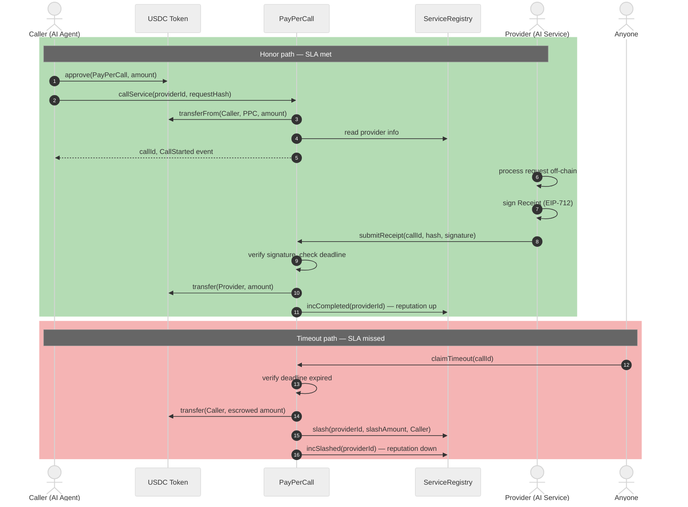

# CallGuard

> Built by an Arc Architects program member.

**Programmable service settlement for autonomous services — built on Arc.**

Providers stake USDC and commit to a response-time SLA. Callers pay per request and get a signed receipt. Miss the deadline and the stake is slashed automatically — no court, no arbiter, no middleman.

Built on [Arc Testnet](https://www.arc.network), Circle's stablecoin-native L1 where USDC is the native gas token. Every interaction — call, receipt, slash — costs a fraction of a cent and settles in under a second.

**Live demo:** [callguard.vercel.app](https://callguard.vercel.app)

---

## Why this matters

AI agents and autonomous services are becoming core infrastructure. As they interact with more external APIs and digital services, they need a reliable way to pay, verify execution, and hold providers accountable — without trusting a centralized intermediary.

CallGuard makes service reliability programmable:

- Provider stakes USDC as a performance bond
- Caller pays per request — USDC goes into escrow
- Provider signs an EIP-712 receipt after delivery — escrow releases
- If the provider misses the SLA window, anyone can trigger a slash — caller gets a refund plus a bonus from the stake

No governance vote. No dispute arbitration. Just contract-defined outcomes.

---

## Live on Arc Testnet

### Deployed contracts (September 2026)

| Contract | Address |
|---|---|
| ServiceRegistry | [`0xea00f898C0eA249de7226b283e93C13eFa7BbcFF`](https://testnet.arcscan.app/address/0xea00f898C0eA249de7226b283e93C13eFa7BbcFF) |
| PayPerCall | [`0x10387347678d9f7106D5625bE0BD6C915158B130`](https://testnet.arcscan.app/address/0x10387347678d9f7106D5625bE0BD6C915158B130) |
| CrossChainReceiver | [`0x28a683A5fAB9B5DC2608089e86d733aB1f116e5c`](https://testnet.arcscan.app/address/0x28a683A5fAB9B5DC2608089e86d733aB1f116e5c) |
| AgenticCommerce (ERC-8183) | [`0x0747EEf0706327138c69792bF28Cd525089e4583`](https://testnet.arcscan.app/address/0x0747EEf0706327138c69792bF28Cd525089e4583) |
| USDC (native gas) | [`0x3600000000000000000000000000000000000000`](https://testnet.arcscan.app/address/0x3600000000000000000000000000000000000000) |
| EURC | [`0x89B50855Aa3bE2F677cD6303Cec089B5F319D72a`](https://testnet.arcscan.app/address/0x89B50855Aa3bE2F677cD6303Cec089B5F319D72a) |
| USYC | [`0xe9185F0c5F296Ed1797AaE4238D26CCaBEadb86C`](https://testnet.arcscan.app/address/0xe9185F0c5F296Ed1797AaE4238D26CCaBEadb86C) |
| Band Oracle | [`0x8c064bCf7C0DA3B3b090BAbFE8f3323534D84d68`](https://testnet.arcscan.app/address/0x8c064bCf7C0DA3B3b090BAbFE8f3323534D84d68) |
| Memo | [`0x5294E9927c3306DcBaDb03fe70b92e01cCede505`](https://testnet.arcscan.app/address/0x5294E9927c3306DcBaDb03fe70b92e01cCede505) |
| Multicall3From | [`0x522fAf9A91c41c443c66765030741e4AaCe147D0`](https://testnet.arcscan.app/address/0x522fAf9A91c41c443c66765030741e4AaCe147D0) |

---

## How it works


```mermaid
%%{init: {'theme':'neutral'}}%%
sequenceDiagram
    autonumber
    actor Caller as Caller (AI Agent)
    participant USDC as USDC Token
    participant PPC as PayPerCall
    participant SR as ServiceRegistry
    actor Provider as Provider (AI Service)
    actor Anyone as Anyone

    rect rgb(180, 220, 180)
    Note over Caller,Provider: Honor path — SLA met

    Caller->>USDC: approve(PayPerCall, amount)
    Caller->>PPC: callService(providerId, requestHash)
    PPC->>USDC: transferFrom(Caller, PPC, amount)
    PPC->>SR: read provider info
    PPC-->>Caller: callId, CallStarted event

    Provider->>Provider: process request off-chain
    Provider->>Provider: sign Receipt (EIP-712)

    Provider->>PPC: submitReceipt(callId, hash, signature)
    PPC->>PPC: verify signature, check deadline
    PPC->>USDC: transfer(Provider, amount)
    PPC->>SR: incCompleted(providerId) — reputation up
    end

    rect rgb(245, 180, 180)
    Note over Caller,Anyone: Timeout path — SLA missed

    Anyone->>PPC: claimTimeout(callId)
    PPC->>PPC: verify deadline expired
    PPC->>USDC: transfer(Caller, escrowed amount)
    PPC->>SR: slash(providerId, slashAmount, Caller)
    PPC->>SR: incSlashed(providerId) — reputation down
    end
```

---

## What's in the app

The app at [arcsla.vercel.app](https://arcsla.vercel.app) is a full-featured single-file dapp (ethers.js v6) that exposes every layer of the protocol.

### Before connecting a wallet

- **Live network stats** — registered providers, calls on-chain, slashes enforced in real time
- **Live activity feed** — streams `CallStarted`, `ReceiptSubmitted`, `CallSlashed`, `ProviderRegistered` events directly from Arc Testnet
- **Role selection** — "I want to call a service" or "I want to provide a service" — routes new users to the right flow immediately
- **Contract address bar** — all deployed addresses with one-click ArcScan links

### Provider tools

- **Register (v1)** — stake USDC, set price, SLA window, and slash percentage
- **Register with NFT (v2)** — mint an ERC-8004 AgentIdentity NFT and register in a single transaction via `RegisterWithNFT`; NFT badge persists in the dashboard across sessions
- **Provider setup checklist** — step-by-step pre-registration guide covering stake, SLA, and endpoint setup
- **Revenue calculator** — estimate monthly earnings based on call volume, price, and SLA honor rate
- **Provider dashboard** — live reputation score, honor rate, recent calls, stake balance, and on-chain analytics via Goldsky
- **Deactivate + Unstake** — wind down an active provider position; withdraw stake once all pending calls settle
- **Provider endpoint health check** — live ping for each registered provider via facilitator proxy

### Caller tools

- **Direct call** — pick a provider, set a payload, approve USDC, call — all in one flow
- **Call Wizard** — guided 3-step flow for first-time callers (select provider → confirm cost → approve and call)
- **Cost calculator** — preview USDC cost, SLA terms, and slash bonus before signing
- **Auto-router v3** — automatically selects the best provider using a 6-factor weighted score: honor rate (35%), onchain reputation (25%), price (15%), stake size (15%), response speed (10%), minus slash penalty
- **Bulk call** — send the same request to multiple providers simultaneously; results displayed in a comparison table
- **Submit receipt** — provider signs an EIP-712 structured receipt; MetaMask shows readable fields (callId, responseHash), not raw hex
- **Claim timeout** — trigger a slash after the SLA window expires; caller gets a refund plus a bonus from the provider's stake

### Payment rails

- **x402 (HTTP 402)** — real HTTP payment flow; client signs an EIP-3009 authorization off-chain (no gas), facilitator verifies and calls `callServiceWithAuthorization()` onchain — USDC goes directly into SLA escrow in a single transaction
- **Circle Gateway Nanopayments** — gasless 0.001 USDC micro-payments; no MetaMask prompt, no gas, no confirmation; facilitator handles settlement server-side with Circle batch processing
- **CCTP multi-chain** — pay from Ethereum Sepolia, Base Sepolia, or Polygon Amoy; CCTP V2 bridges USDC to Arc where SLA enforcement happens; caller never needs to touch Arc directly

### Settlement and history

- **Disputes panel** — view open and resolved disputes; slash history sourced from Goldsky subgraph v2.0.0
- **Subscriptions panel** — recurring payment history and renewal tracking from subgraph
- **My Calls** — full call history for the connected wallet with status indicators (pending, honored, slashed, timed out)
- **Receipts** — all submitted receipts with on-chain verification status
- **Payments** — USDC in/out transaction history

### Jobs (ERC-8183)

- **Job wizard** — 5-step lifecycle: Create → Set Budget → Fund → Submit → Complete; role badges for Client, Provider, and Evaluator
- **My Jobs** — one-click list of all jobs where you are client or provider, sourced from Goldsky subgraph
- **Auto-advance** — wizard moves to the next step automatically after each on-chain confirmation

### Developer tools

- **SDK examples** — working code snippets in Browser JS, Node.js, Python, and curl
- **MCP server** — 6 tools for AI agents: list providers, leaderboard, health check, nanopay, network stats, Arc docs search. Works with Claude Desktop, Cursor, or any MCP-compatible client
- **Webhooks** — configure webhook endpoints for live event delivery; built-in test tool sends a real `call.opened` payload and shows response status + latency
- **Multicall3From** — batch calls to multiple providers in one transaction using Arc's native batching contract; `msg.sender` preserved via Arc CallFrom precompile
- **Arc Memo** — every x402 call attaches a human-readable onchain memo via Arc's Memo contract; visible on ArcScan for reconciliation

### Infrastructure and analytics

- **Goldsky subgraph v2.0.0** — indexes Provider, Call, Dispute, and Subscription events; powers real-time GraphQL queries across the app
- **Analytics panel** — provider activity charts, honor rate trends, call volume from Goldsky
- **Leaderboard** — top 10 providers ranked by Bayesian reputation score with honor rate and call volume
- **Band Protocol oracle** — live USDC/USD price feed; provider prices displayed in USD alongside USDC
- **Post-quantum receipt signing** — every receipt carries a SLH-DSA-SHA2-128s signature (NIST FIPS 205), compatible with Arc's PQ precompile
- **Arc Privacy Sector (APS)** — vision panel for private SLA calls inside hardware enclaves; integration ready when APS precompile API is public

### UX features

- **Simple / Pro mode** — toggle in the topbar; Simple hides advanced options for first-time users
- **Dark / Light theme** — toggle in Settings; preference persists across sessions
- **Onboarding wizard** — 3-step guided setup on first login: connect wallet → get USDC → make first call
- **Session budget cap** — set a USDC spending limit; banner warns before any call that would exceed it
- **Spend limit banner** — dismissable per-session; reappears if the budget threshold is crossed again
- **Next-step nudge** — after each completed action, a contextual suggestion guides the user to the logical next step
- **CMD palette** — press `⌘K` / `Ctrl+K` to navigate anywhere in the app from the keyboard
- **Notifications panel** — in-app event log for completed calls, receipts, slashes, and system alerts
- **EURC + USYC balances** — header shows all Arc ecosystem token balances alongside USDC
- **Role choice modal** — on first wallet connection, users choose Caller or Provider; routes directly to the relevant flow

---

## x402 integration

CallGuard implements the [x402 HTTP Payment Protocol](https://x402.org) as a composable layer on top of the pay-per-call flow.

```
x402       → answers "how does the agent pay?" (HTTP 402, EIP-3009 authorization)
CallGuard  → answers "what does the agent get?" (stake-backed SLA, verifiable receipt)
```

**Flow:**

```
1. Agent  → GET /service  (no payment)
2. Server → 402 Payment Required + payment requirements
3. Agent  → signs EIP-3009 TransferWithAuthorization off-chain (no gas)
4. Facilitator → calls callServiceWithAuthorization() onchain
5. SLA clock starts — USDC in escrow
6. Provider delivers off-chain → submits EIP-712 receipt → gets paid
```

**Start a provider server:**

```bash
cd scripts
PRIVATE_KEY=0x... PROVIDER_ID=1 ARC_RPC_URL=https://rpc.testnet.arc.network node x402-provider.js
# → http://localhost:3000/service
```

---

## CCTP multi-chain payments

Callers on any supported chain pay with their native USDC. CCTP V2 bridges it to Arc where SLA enforcement happens — callers never need to touch Arc directly.

**Supported source chains (testnet):** Ethereum Sepolia · Base Sepolia · Polygon Amoy

```
depositForBurn() on source chain
    → Circle Iris attestation (~20-60s)
    → receiveMessage() on Arc
    → CrossChainReceiver.handleReceiveFinalizedTransfer()
    → callService() fires automatically
```

---

## Getting started

### Prerequisites

```bash
curl -L https://foundry.paradigm.xyz | bash && foundryup
```

### Install and build

```bash
git clone https://github.com/muazzezwq/CallGuard
cd CallGuard
forge install && forge build
```

### Run tests

```bash
forge test -vv
```

Expected: **67 tests passed, 0 failed.**

### Try the demo

Open [callguard.vercel.app](https://callguard.vercel.app) with MetaMask — Arc Testnet is added automatically.

Or run locally:

```bash
bun install && bun run dev
# → http://localhost:5173
```

### Deploy your own copy

```bash
cp .env.example .env
# Set USDC_ADDRESS=0x3600000000000000000000000000000000000000

cast wallet import deployer --interactive

forge script script/Deploy.s.sol:Deploy \
  --account deployer \
  --sender 0xYOUR_DEPLOYER \
  --rpc-url arc_testnet \
  --broadcast
```

See [`DEPLOY.md`](./DEPLOY.md) for the full walkthrough.

---

## Solidity example

```solidity
// 1. Caller approves USDC
usdc.approve(address(payPerCall), 1e6); // 1 USDC

// 2. Caller opens the call — USDC goes into escrow
bytes32 requestHash = keccak256(abi.encode("summarize this document"));
bytes32 callId = payPerCall.callService(providerId, requestHash);

// 3. Provider processes off-chain, signs an EIP-712 receipt
bytes32 responseHash = keccak256(responseBytes);
bytes memory sig = providerSigner.signTypedData(domain, types, value);

// 4. Provider submits the receipt — escrow releases, reputation increases
payPerCall.submitReceipt(callId, responseHash, sig);

// 5. If the provider misses the deadline — anyone can slash
payPerCall.claimTimeout(callId);
// → caller refunded + provider stake slashed + reputation decreases
```

---

## Project layout

```
CallGuard/
├── src/
│   ├── ServiceRegistry.sol       # provider registry, stake, ERC-8004 NFT binding, Bayesian reputation
│   ├── PayPerCall.sol            # call escrow, EIP-712 receipt verification, timeout/slash
│   ├── Subscription.sol          # recurring payment model
│   ├── Dispute.sol               # dispute resolution with stake slashing
│   ├── CrossChainReceiver.sol    # CCTP V2 — bridges multi-chain USDC into callService()
│   ├── RegisterWithNFT.sol       # mints ERC-8004 NFT + registerV2() in one transaction
│   ├── X402Middleware.sol        # bridges HTTP 402 / EIP-3009 into callService()
│   └── interfaces/
├── test/
│   ├── ServiceRegistry.t.sol     # 45 unit tests
│   ├── PayPerCall.t.sol          # 22 unit tests
│   └── helpers/MockUSDC.sol
├── script/Deploy.s.sol           # deploys all contracts
├── scripts/
│   ├── x402-provider.js          # Node.js x402 provider server
│   └── bridge-and-call.ts        # CCTP bridge helper
├── api/                          # Vercel serverless functions (auto-receipt, x402, nano, webhook)
├── app/app/index.html            # single-file dapp (ethers.js v6, no build step)
├── subgraph/                     # Goldsky subgraph v2.0.0
├── x402-facilitator/             # x402 + Gateway facilitator server
├── docs/
├── SPEC.md
├── ARCHITECTURE.md
├── SECURITY.md
└── DEPLOY.md
```

---

## Known limitations

- **CCTP attestation takes 1-4 minutes.** Sepolia requires ~12-19 block confirmations before Circle Iris issues an attestation. The demo polls for up to 5 minutes.
- **Event scan window is 100,000 blocks.** Very old calls won't appear in the Calls panel. Goldsky subgraph covers the full history.
- **Testnet only.** All contracts are deployed on Arc Testnet. No mainnet deployment yet.

---

## Roadmap

### Completed

- EIP-712 typed receipt signing — structured receipt preview in MetaMask
- ERC-8004 NFT identity binding — `registerV2()` requires AgentIdentity NFT; mint + register in one tx
- CCTP multi-chain payments — Ethereum / Base / Polygon → Arc via Circle CCTP V2
- x402 HTTP payment protocol — full EIP-3009 authorization flow, gasless for the caller
- Circle Gateway Nanopayments — gasless micro-payments, server-side settlement
- ERC-8183 Jobs — full 5-step lifecycle wizard with role badges
- My Jobs list — Goldsky subgraph event-sourced job history per wallet
- Provider endpoint health check — live ping via facilitator proxy
- Multicall3From — Arc native batch calls in a single tx, `msg.sender` preserved
- Arc Memo extension — human-readable onchain memo on every x402 call
- Post-quantum receipt signing — SLH-DSA-SHA2-128s (NIST FIPS 205)
- Band Protocol oracle — live USDC/USD price feed on Arc
- MCP server — 6 tools for AI agents (list, health, nanopay, stats, docs search)
- Goldsky subgraph v2.0.0 — Provider, Call, Dispute, Subscription events indexed
- Analytics panel — provider activity bars, honor rate, call volume from Goldsky
- Disputes panel — dispute history and slash status from subgraph
- Subscriptions panel — recurring payment history from subgraph
- Auto-router v3 — 6-factor weighted provider scoring
- Unstake flow — deactivate provider + withdraw stake from the UI
- ERC-8004 NFT badge — displayed in provider dashboard, persists across sessions
- Webhooks panel — configure endpoints + test with real `call.opened` payload
- SDK examples — Browser JS, Node.js, Python, curl
- Simple/Pro mode, Dark/Light theme, CMD palette, onboarding wizard
- 67/67 Foundry tests

### Planned

- APS private SLA calls — when Arc Privacy Sector precompile API is public
- EIP-1271 support for contract-wallet callers
- On-chain dispute resolution module for subjective-quality services
- Reputation-weighted routing contract
- Mainnet deployment

---

## Resources

### Arc & Circle

- [Arc Network](https://www.arc.network/) — project homepage
- [Arc documentation](https://docs.arc.network/arc/concepts/welcome-to-arc) — concepts, architecture, guides
- [Circle Developers](https://developers.circle.com/) — SDKs, CCTP, Gateway, Paymaster
- [Circle Console](https://console.circle.com/signin) — API keys, testnet dashboards

### Testnet tools

- [Arc Testnet Faucet](https://faucet.circle.com/) — free testnet USDC (also covers gas)
- [ArcScan Testnet](https://testnet.arcscan.app/) — block explorer
- [thirdweb Arc Testnet](https://thirdweb.com/arc-testnet) — chain config, contract explorer

### Project documents

- [`ARCHITECTURE.md`](./ARCHITECTURE.md) — design decisions and rationale
- [`SECURITY.md`](./SECURITY.md) — threat model and known trade-offs
- [`DEPLOY.md`](./DEPLOY.md) — step-by-step deployment guide
- [`SPEC.md`](./SPEC.md) — original technical specification

---

MIT License. Not affiliated with Circle, Arc, or any project mentioned above. Built independently for the Arc Architects community.
